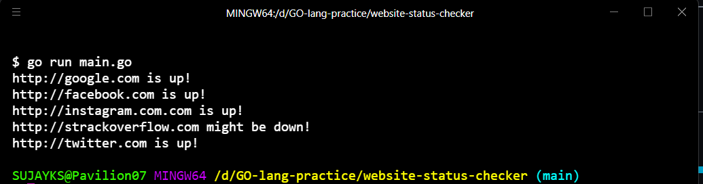

 
<h1>Website Status Checker</h1>

A simple project which enables you to check wheather the website is accepting the traffic and is it up or is the website has been crashed

## About

A simple project made out of Go-lang which enables you to check wheather the website is accepting the traffic and is it up or is the website has been crashed
## Demonstration

<a href="https://iamrajiv.github.ioRain-Simulation/">go run main.go</a>

