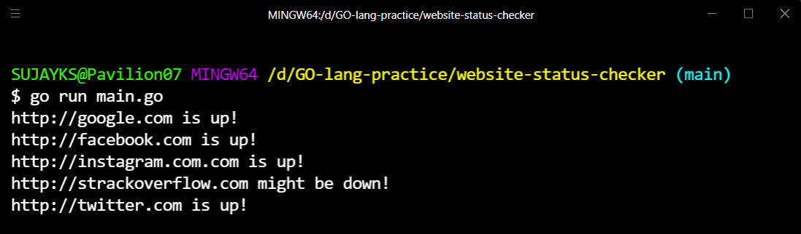

 
<h1>Website Status Checker</h1>

A simple project which enables you to check wheather the website is up and working fine or is the website has been crashed.

## About

A project made out of Go-lang which enables you to check wheather the website is accepting the traffic and checks it is up or is the website has been crashed. using Go routines and channels

## Demonstration

<a>go run main.go</a>

